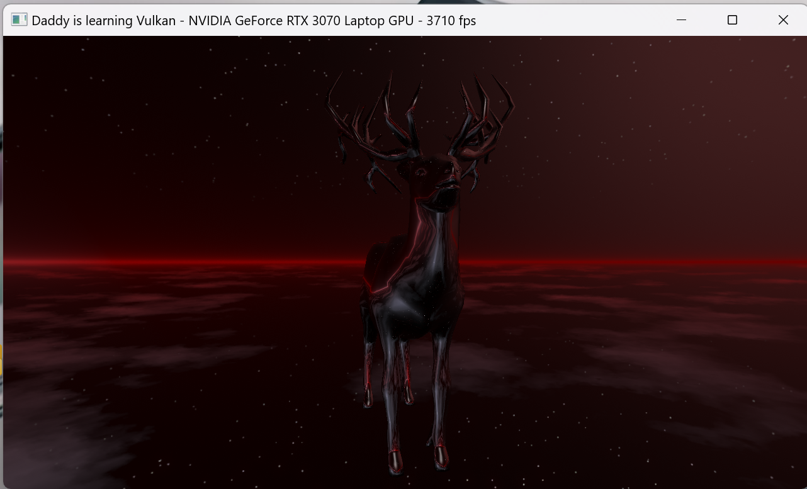
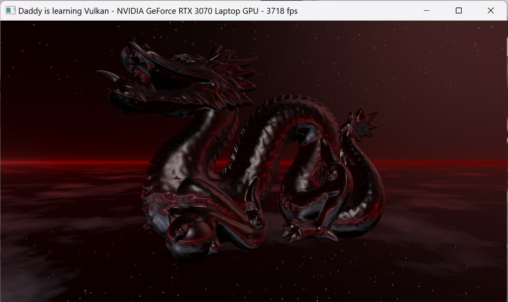
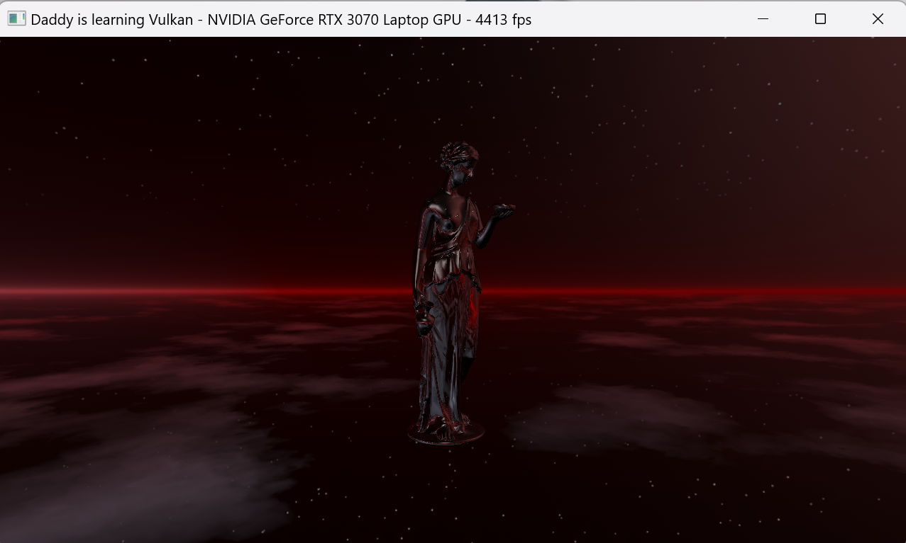
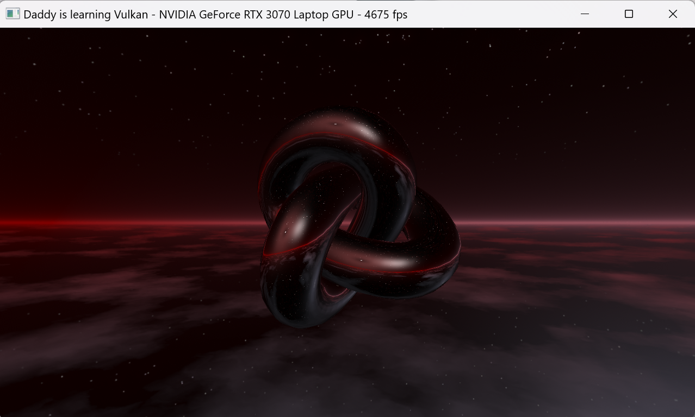
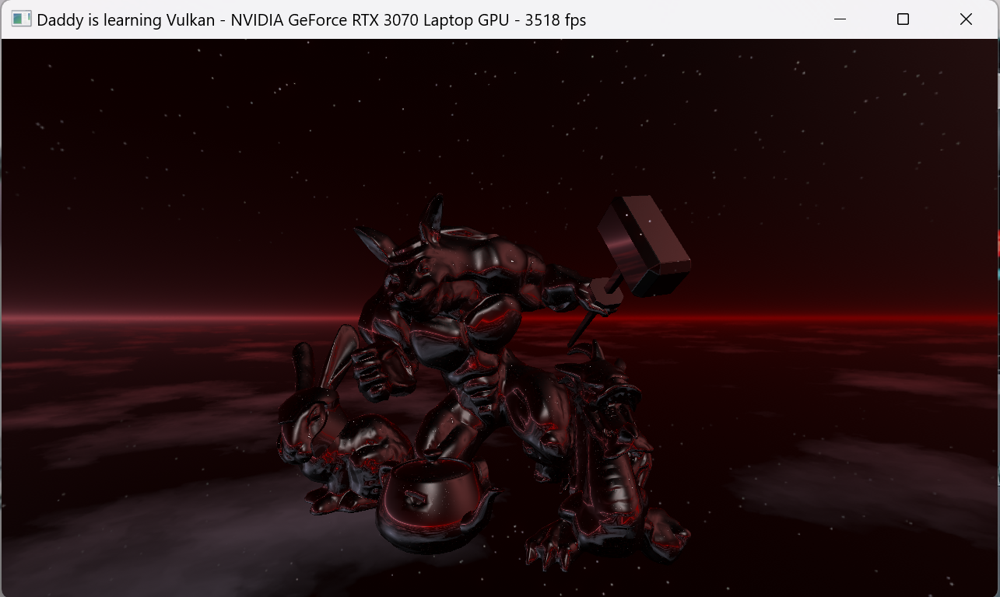

# Vulkan Demo
Fork of "Vulkan C++ examples and demos repository" with changes for learning purposes.

#### [Cube map textures](examples/texturecubemap/)
Loads a cube map texture from disk containing six different faces. All faces and mip levels are uploaded into video memory, and the cubemap is displayed on a skybox as a backdrop and on a 3D model as a reflection.

Changes:
* Added camera rotation logic
* Added logic to change model using a high resolution timer
* Removed debug ui
* Other minor changes

## Video Demo

## Screenshots

## Credits and Attributions
See [README-original.md](README-original.md) for the original author copyright notice and [CREDITS.md](CREDITS.md) for additional credits and attributions.